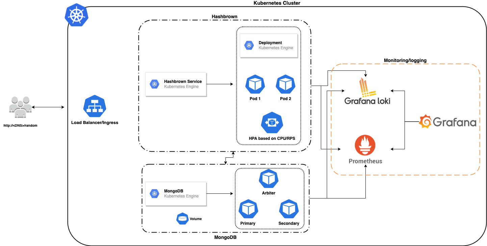

# Helm chart to deploy hashbrown in Kubernetes

`Hashbrown` is a free and open-source headless CMS built with Node.js and MongoDB. This is a helm chart developed on top of the open-source solution to build and deploy the complete application on a Kubernetes cluster.

## Architecture:


## Requirements:
- Kubernetes 1.18+
- Helm v3
- Kubectl
- Docker

## Components:
- MongoDB
- Hashbrown application
- Prometheus
- Grafana
- Loki
- Traefik

## Setup:

### Build the docker image and push it to container registry
```bash
$ docker build -t <image_name> .
$ docker tag <image_name> <remote_image_name>
$ docker push <remote_image_name>
```

### Create common namespace for hashbrown and mongoDB deployments
```bash 
$ kubectl create namespace hashbrown
```

### Add official helm repo for mongodb
```bash
$ helm repo add bitnami https://charts.bitnami.com/bitnami
$ helm repo update
```

### Deploy mongodb
```bash
$ helm install hashbrown-mongodb bitnami/mongodb --set auth.rootPassword=hashBrown,persistence.size=15Gi -n hashbrown
```

### Create traefik middleware to handle the routings

- This middleware component of traefik helps us to use `/random` redirect to internal application setup process. So ideally all the requests coming to `http://<DNS>/random` will be forwarded to the internal application endpoints.

```bash
$ kubectl apply -f charts/traefik-middleware.yaml
```

## Hashbrown helm chart deployment instructions:

- Open values.yaml in `charts/hashbrown` folder and replace the `repository` with docker-image from image section
- Replace the `MONGODB_HOST`, `MONGODB_USERNAME`, `MONGODB_PASSWORD` from projectEnv section(if needed)
- Replace the `hosts` and `tls` with the actual domain which will be useful to access the application outside of the cluster with ssl enabled
- Install the chart with below command:

```bash
$ helm upgrade --install hashbrown charts/hashbrown -f charts/hashbrown/values.yaml -n hashbrown
```

## Monitoring and Logging

- We are using Prometheus/Grafana/Loki stack to aggregate logs and create metrics to track the application behaviour
- Prometheus - Used to extract and store all the metric data from applications and kubernetes components 
- Loki - Used to extract and aggregate all the application or container logs running inside kubernetes 
- Grafana - Used to visualize all the metric and log data that comes from prometheus and loki

### Create a namespace for monitoring stack 

```bash 
$ kubectl create namespace monitoring
```

### Monitoring stack helm chart deployment instructions:
- Install the monitoring chart with below command:

```bash
$ helm upgrade --install monitoring charts/monitoring -f charts/monitoring/values.yaml -n hashbrown
```

### Access grafana 
- Once the install is done, use port-forward to access the application in your browser

```bash
$ kubectl port-forward -n monitoring <GRAFANA-POD> 3000
```

- Open your browser and hit `http://localhost:3000` to access the grafana UI and login to the application.

- To get the password, use the base64 decode.

```bash
$ kubectl get secret monitoring-grafana -n monitoring -o yaml

$ echo -n "<ENCODED PASSWORD FROM THE SECRET>" | base64 --decode
$ echo -n "<ENCODED USERNAME FROM THE SECRET>" | base64 --decode
```

- After login, click on the `Kubernetes Cluster Monitoring` dashboard to see the sample graphs to monitor the cluster/applications.

### Access Loki
 - Loki is used for accessing the application logs by developers to debug the errors or failures in the system.
 - To access it navigate to the grafana UI --> Explore --> Select Loki from the dropdown --> Run the below given sample query to see the logs

```bash
 {job="hashbrown/hashbrown-mongodb"}
 ```

## Improvements

- Cert-manager can be used on the platform to auto-generate SSL certs and use HTTPS for accessing the application.
- For production level architecture, Multiple replicas can be used for the web app as well as the DB inorder to maintain high-availability of the application and prevent lose of data. (Reference to it is given in the Architecture diagram attached)
- HPA can be configured with multiple metrics(CPU/Memory/RPS) to autoscale the application based on the traffic that hits the application.
- Monitoring can be improved with multiple graphs for the indepth analysis of the cluster and the application
- Alert manager can be configured for creating alerts on the cluster when ever there is anything wrong in the application which will trigger notifications via email/slack or any other notification channels.
- CI/CD can be configured to automate the build and deployment of the code. As we are using github in this case, we can use github-actions to automate the complete process. Push the code -> Build docker image -> Use the commit of the build and deploy the docker image to the kubernetes cluster using helm and its values. All these steps can be developed into multiple stages of a github-actions pipeline.
